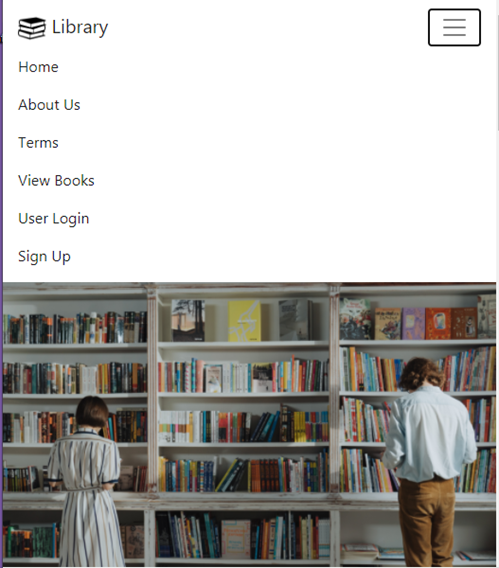
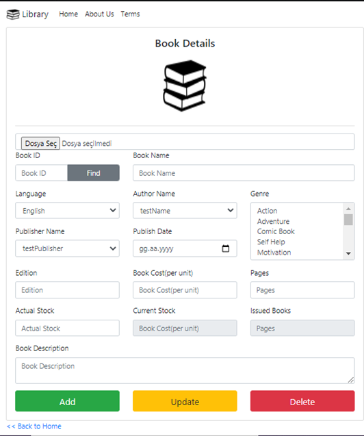
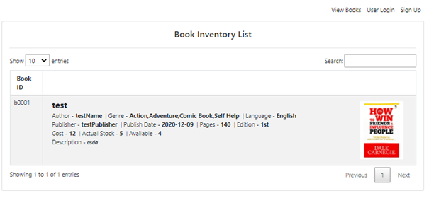

# `Library Management System`
The main goal of the project is to implement an innovative Library Management System. Library management systems are very popular and actively used today. The system, which was created with various innovations and users in mind, aims to provide convenience to people in the days of continuing life from home with the pandemic process. The project features list is given below.
## User and Admin Features

User:
- Registration to the E-Library System
- Login to the E-Library System
- E-Book purchase/return Process
- Book and resource procurement
- Book and Source Return
- Catalog Scan
- E-Meeting Reservation
- E-Library System Exit Process

Admin:
- User Registration Update
- Add/Delete Resources
- Resource Update
## Tech and Libraries

- Visual Studio  
- MS Sql Server
- Bootstrap
- ASP .NET

## Screenshots

|  |
| :--:|
| *Home Page (Responsive)* |

|  |
| :--:|
| *Admin Book Add Form* |

|  |
| :--:|
| *Book List* |